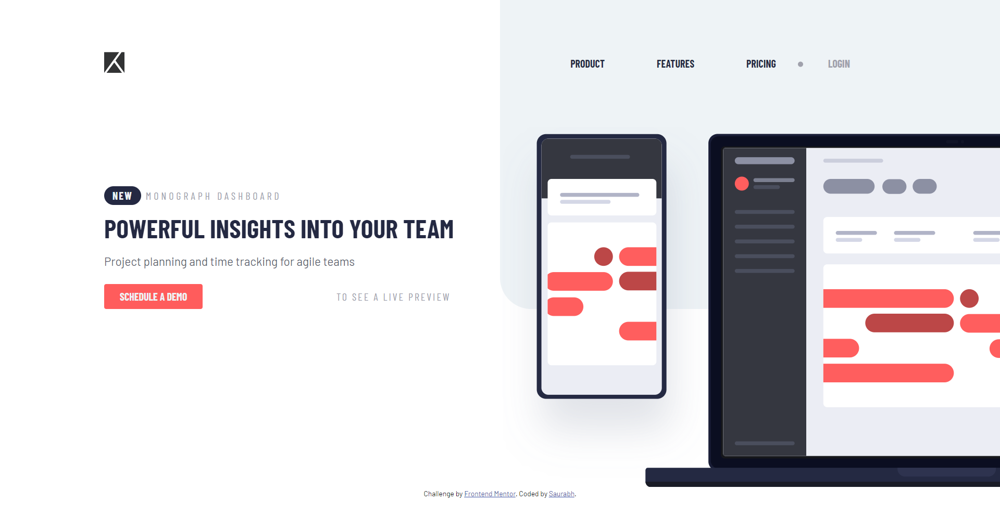
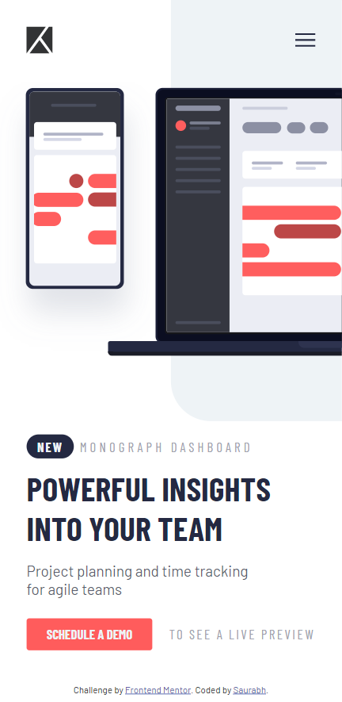
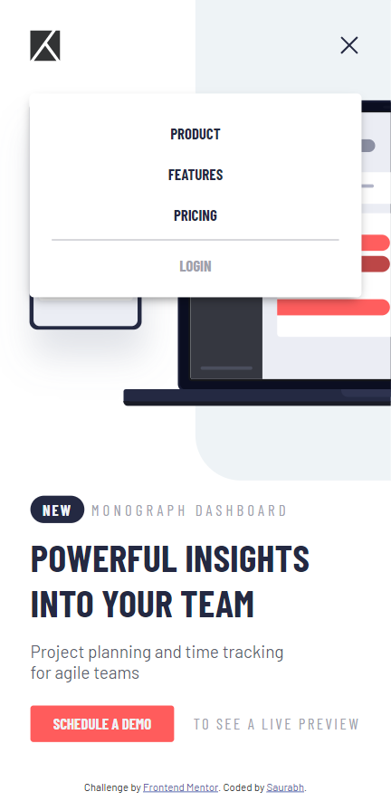

# Frontend Mentor - Project tracking intro component solution

This is a solution to the [Project tracking intro component challenge on Frontend Mentor](https://www.frontendmentor.io/challenges/project-tracking-intro-component-5d289097500fcb331a67d80e). Frontend Mentor challenges help you improve your coding skills by building realistic projects.

## Table of contents

- [Overview](#overview)
  - [The challenge](#the-challenge)
  - [Screenshots](#screenshots)
  - [Links](#links)
- [My process](#my-process)
  - [Built with](#built-with)
  - [What I learned](#what-i-learned)
  - [Continued development](#continued-development)
  - [Useful resources](#useful-resources)
- [Author](#author)
- [Acknowledgments](#acknowledgments)

## Overview

### The challenge

Users should be able to:

- View the optimal layout for the site depending on their device's screen size
- See hover states for all interactive elements on the page
- Create the background shape using code

### Screenshots

#### Desktop

#### Mobile

#### Mobile Nav

### Links

- Live Site URL: [Add live site URL here](https://your-live-site-url.com)

## My process

### Built with

- Semantic HTML5 markup
- CSS custom properties
- SCSS
- Flexbox
- Mobile-first workflow

### What I learned

Through this project I was able to gain more understanding in the concept of flexbox and also implement them effectively inorder to bring the design to life. I was also tracking the speed that I'd agin while doing this and I'm glad that it's getting better for me. I'll be focusing even more on the time management and complete the projects as quickly as possible.

### Continued development

I'll be focusing more on the psuedo elements and also the border property inorder to make shapes on elements which could make the design cooler. Animations will also be in focus.

### Useful resources

- [W3 Schools](https://www.w3schools.com/) - This has been my first line of contact when I was stuck at stages. It usually solved all my quests.

## Author

- Frontend Mentor - [@saurabh1996-rex](https://www.frontendmentor.io/profile/saurabh1996-rex)

## Acknowledgments

Always thankful to Frontendmentor.io as they've provided all the necessary files so that it was easier to work with the project. Also special metion to the one who have designed this project, Great Work!
